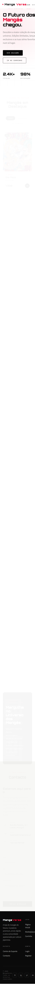
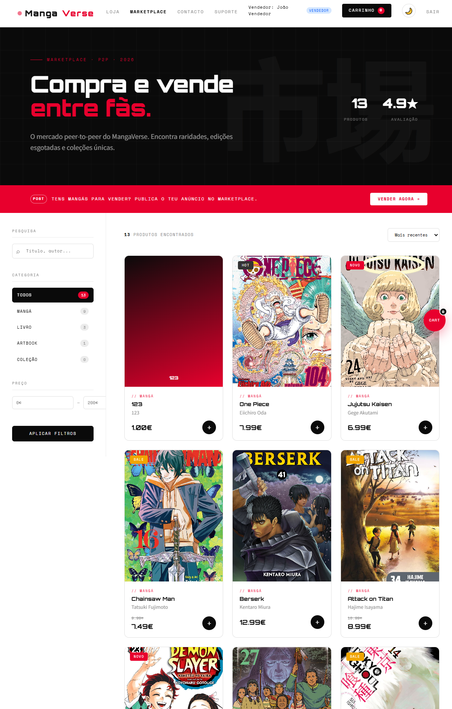
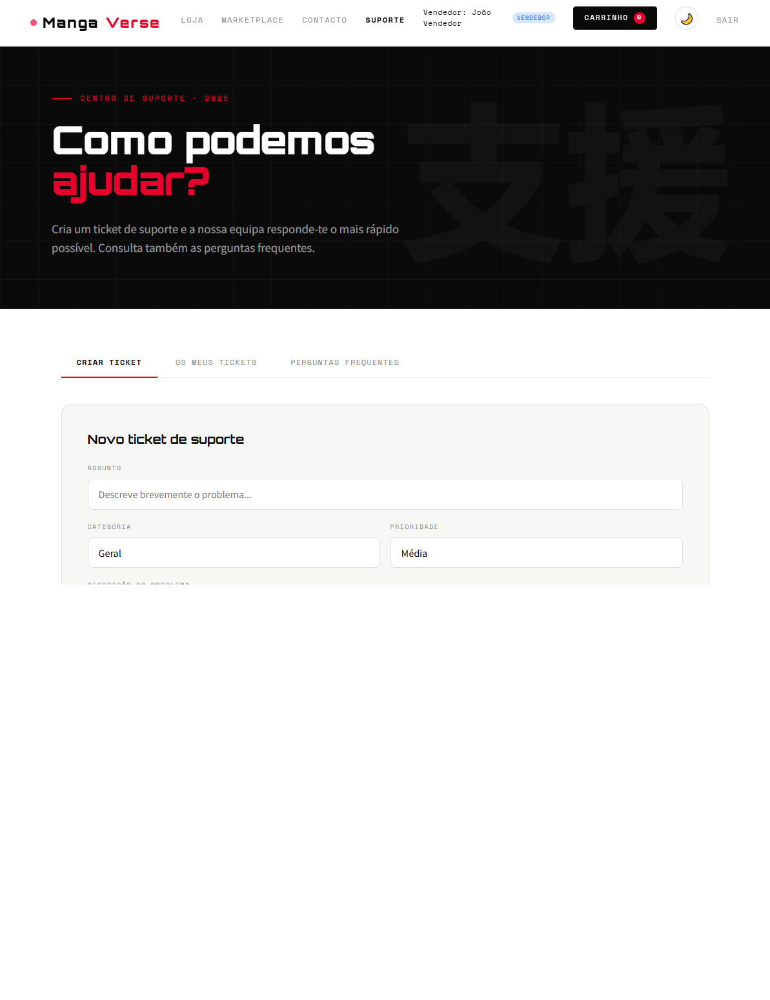
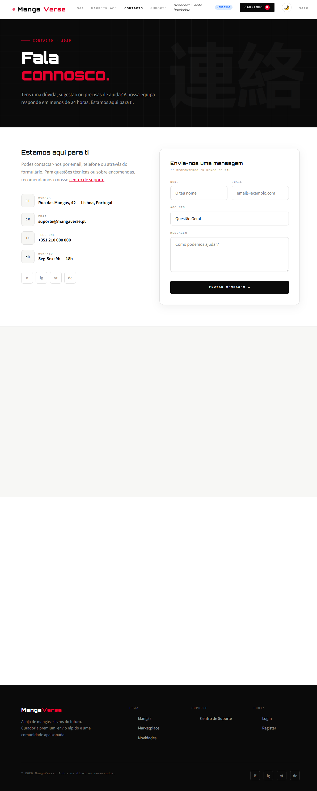

# Prova de Aptidão Profissional

## Relatório Final do Projeto

## MangaVerse

Plataforma web para compra, venda e gestão de mangás

Aluno: [Nome do aluno]

Orientadora: Tania

Escola: [Nome da escola]

Curso: [Nome do curso]

Ano letivo: 2025/2026

Data de entrega: Maio de 2026

\newpage

# Agradecimentos

Quero agradecer, em primeiro lugar, à escola pela oportunidade de desenvolver este projeto no âmbito da Prova de Aptidão Profissional, permitindo-me aplicar conhecimentos técnicos num trabalho prático, completo e próximo de um contexto real.

Agradeço também aos professores e, em especial, aos docentes que acompanharam este percurso, pelo apoio prestado, pela orientação técnica e pelas sugestões que contribuíram para melhorar a qualidade do projeto.

Deixo igualmente uma palavra de agradecimento aos colegas e a todas as pessoas que, direta ou indiretamente, ajudaram com opiniões, testes e validações durante o desenvolvimento.

Por fim, agradeço à minha família pelo apoio, incentivo e compreensão ao longo de todo o processo de realização deste trabalho.

\newpage

# Resumo

O presente relatório apresenta o projeto MangaVerse, uma plataforma web criada para facilitar a compra, a venda e a divulgação de mangás num único espaço digital. O projeto foi desenvolvido no âmbito da Prova de Aptidão Profissional e pretende demonstrar a capacidade de planear, construir e testar uma aplicação web funcional.

Em termos práticos, o sistema reúne numa só plataforma uma loja online, um marketplace entre utilizadores, autenticação com diferentes perfis, carrinho de compras, finalização de encomendas, contacto, suporte e área de administração. O projeto foi desenvolvido com PHP, MySQL, jQuery, Bootstrap, SweetAlert2, Stripe e Chart.js, tecnologias que são explicadas ao longo do relatório de forma simples.

Para além do funcionamento técnico, houve uma preocupação constante com a clareza da interface, a coerência visual entre páginas e a separação de permissões entre cliente, vendedor e administrador. Na versão atual, o vendedor e o administrador podem publicar mangás no marketplace com imagem de capa, ficando guardado na base de dados o caminho do ficheiro enviado.

Palavras-chave: PAP, PHP, MySQL, marketplace, e-commerce, mangá, autenticação, upload de imagens, suporte, administração.

\newpage

# Índice

1. Introdução
2. Enquadramento do projeto
3. Glossário de termos técnicos
4. Objetivos
5. Requisitos funcionais e perfis de utilizador
6. Tecnologias utilizadas
7. Arquitetura e organização do projeto
8. Base de dados
9. Implementação das funcionalidades principais
10. Segurança, validação e permissões
11. Testes realizados
12. Dificuldades encontradas e soluções adotadas
13. Conclusão
14. Melhorias futuras
15. Bibliografia e recursos consultados

\newpage

# 1. Introdução

O projeto MangaVerse foi desenvolvido com o objetivo de criar uma plataforma web funcional, moderna e fácil de utilizar, dedicada ao universo dos mangás. A ideia principal consistiu em construir uma aplicação que juntasse duas vertentes importantes: uma loja online com catálogo e carrinho de compras, e um marketplace onde utilizadores autorizados podem publicar os seus próprios mangás para venda.

Ao longo do desenvolvimento, o projeto foi pensado como um sistema completo, abrangendo áreas como registo e login, gestão de utilizadores, armazenamento de dados, compras, suporte ao utilizador e administração da plataforma.

Este relatório foi escrito de forma clara e acessível, para que possa ser compreendido mesmo por quem não tem conhecimentos de programação. Sempre que surge um termo mais técnico, o seu significado pode ser consultado no glossário.

Ao longo das secções seguintes são apresentados os objetivos do projeto, a sua estrutura, as tecnologias utilizadas, a base de dados, as principais funcionalidades, os testes realizados e as conclusões obtidas.

# 2. Enquadramento do Projeto

O MangaVerse surge como uma proposta de plataforma especializada em mangás, com foco numa navegação simples, visualmente apelativa e adequada a diferentes tipos de utilizador.

O projeto foi concebido para funcionar localmente num ambiente de testes, com uma estrutura capaz de responder às necessidades mais comuns de uma plataforma de comércio eletrónico:

- catálogo com pesquisa e filtragem;
- autenticação de utilizadores;
- separação de permissões por perfis;
- carrinho de compras e checkout;
- marketplace com publicações de vendedores;
- contacto e suporte;
- painel de administração com visão global da plataforma.

Apesar de ter sido desenvolvido em contexto académico, o projeto foi tratado com uma lógica próxima de uma solução real, procurando manter coerência entre a interface, as regras de funcionamento e a informação guardada na base de dados.

# 3. Glossário de Termos Técnicos

| Termo | Significado simples |
|---|---|
| Autenticação | Processo usado para confirmar a identidade do utilizador no login |
| Base de dados | Local onde a informação do sistema fica guardada de forma organizada |
| Backend | Parte interna do sistema, responsável pela lógica e pelo tratamento de dados |
| Carrinho de compras | Área onde o utilizador junta os produtos antes de concluir a compra |
| Checkout | Etapa final da compra, onde são confirmados os dados e o pagamento |
| Dashboard | Painel com informação resumida e indicadores importantes |
| Frontend | Parte visível do site, ou seja, aquilo que o utilizador vê e utiliza |
| Marketplace | Espaço onde diferentes utilizadores podem publicar produtos para venda |
| Modal | Janela ou painel que surge por cima da página para mostrar ou editar informação |
| Responsivo | Capaz de se adaptar a telemóveis, tablets e computadores |
| Sessão | Informação temporária que permite ao sistema reconhecer um utilizador ligado |
| Upload | Envio de um ficheiro do computador para o site |
| XAMPP | Programa usado para criar um servidor local de testes no computador |
| jQuery | Biblioteca que ajuda a tornar a página mais dinâmica |
| PHP | Linguagem usada para tratar a lógica principal do projeto |
| MySQL | Sistema usado para guardar e organizar os dados da aplicação |
| Stripe | Serviço utilizado para apoiar o processo de pagamento |

# 4. Objetivos

## 4.1 Objetivo geral

Desenvolver uma plataforma web funcional dedicada ao universo dos mangás, integrando loja online, marketplace, autenticação por perfis, carrinho de compras, suporte ao utilizador e administração da plataforma.

## 4.2 Objetivos específicos

- criar uma interface moderna, coerente e responsiva;
- implementar autenticação segura com diferentes perfis de utilizador;
- permitir ao cliente visualizar, adicionar ao carrinho e comprar produtos, sem acesso à gestão de anúncios;
- permitir ao vendedor fazer CRUD dos seus próprios mangás no marketplace;
- permitir ao administrador fazer gestão global da plataforma e CRUD sobre os produtos do marketplace;
- permitir o envio de imagens de capa no momento da criação de um mangá, com gravação do caminho na base de dados;
- implementar um sistema de carrinho e finalização de compra;
- disponibilizar um sistema de contacto e tickets de suporte;
- criar um dashboard administrativo com métricas e dados relevantes;
- organizar o projeto de forma modular e de fácil manutenção.

# 5. Requisitos Funcionais e Perfis de Utilizador

## 5.1 Perfis de utilizador

O sistema trabalha com três perfis distintos:

| Perfil | Permissões principais |
|---|---|
| Cliente | Ver produtos, pesquisar, filtrar, adicionar ao carrinho, comprar, usar contacto e suporte |
| Vendedor | Todas as permissões do cliente e CRUD dos seus próprios mangás no marketplace |
| Administrador | Gestão global da plataforma, acesso ao painel administrativo e CRUD sobre qualquer produto do marketplace |

Na implementação atual, o cliente fica limitado à experiência de compra: pode navegar, consultar produtos, adicionar ao carrinho e concluir encomendas, mas não pode criar, editar ou eliminar anúncios. O vendedor pode criar, consultar, editar e eliminar os seus próprios produtos no marketplace. O administrador dispõe das mesmas operações de CRUD, com a diferença de que as pode aplicar a qualquer produto existente na plataforma.

## 5.2 Requisitos funcionais implementados

- registo e login de utilizadores;
- manutenção de sessão autenticada;
- catálogo com listagem e ordenação;
- filtros por categoria, pesquisa e preço;
- visualização detalhada de produto;
- carrinho de compras;
- checkout com integração Stripe;
- criação de encomendas e respetivos itens;
- formulário de contacto;
- sistema de tickets de suporte com acompanhamento por estado e respostas associadas;
- painel administrativo com indicadores estatísticos e gráficos de apoio à decisão;
- publicação de mangás por utilizadores autorizados;
- CRUD de mangás no marketplace conforme o perfil e a propriedade do produto;
- upload de imagem com armazenamento do caminho relativo na base de dados;
- alternância entre light mode e dark mode.

# 6. Tecnologias Utilizadas

As tecnologias selecionadas foram escolhidas pela sua utilidade prática, facilidade de integração e adequação ao contexto do projeto. Para um leitor não técnico, a tabela seguinte resume o papel de cada uma delas de forma simples.

| Tecnologia | Função no projeto |
|---|---|
| PHP 8.x | Linguagem usada para tratar a lógica do site e a comunicação com os dados |
| MySQL / MariaDB | Sistema onde ficam guardadas as informações da plataforma |
| jQuery 3.7 | Biblioteca usada para atualizar partes da página sem recarregar tudo |
| Bootstrap 5.3 | Ferramenta de apoio ao layout e à adaptação a vários ecrãs |
| SweetAlert2 | Biblioteca usada para mostrar mensagens e avisos visuais |
| Stripe.js | Ferramenta de apoio ao processo de pagamento |
| Chart.js | Biblioteca usada para criar gráficos no painel de administração |
| HTML5 / CSS3 | Base da estrutura e da apresentação visual das páginas |
| XAMPP | Programa usado para criar um servidor local no computador |

Em termos visuais, foram usadas fontes e estilos gráficos capazes de reforçar a identidade do projeto e a sua ligação ao universo japonês e digital, sem comprometer a legibilidade.

# 7. Arquitetura e Organização do Projeto

O projeto foi organizado por áreas de responsabilidade, de forma a que cada conjunto de ficheiros tenha uma função bem definida. Esta separação torna o sistema mais fácil de compreender, corrigir e melhorar.

## 7.1 Organização geral

- `assets/model/` contém os ficheiros que tratam da leitura e escrita de dados;
- `assets/controller/` contém os ficheiros que recebem pedidos e decidem o que o sistema deve fazer;
- `assets/includes/` contém elementos reutilizáveis, como a barra de navegação e o rodapé;
- as páginas `.php` na raiz do projeto representam a parte visível para o utilizador;
- `database/mangaverse.sql` contém a estrutura da base de dados e os dados iniciais do projeto.

## 7.2 Separação por responsabilidade

| Camada | Responsabilidade |
|---|---|
| Interface | Parte visual do site e interação com o utilizador |
| Controladores | Recebem pedidos, validam dados e escolhem a ação a executar |
| Modelos | Comunicam com a base de dados |
| Base de dados | Guarda permanentemente a informação do sistema |

Esta divisão melhora a organização do trabalho e facilita futuras alterações sem necessidade de reestruturar todo o projeto.

# 8. Base de Dados

## 8.1 Base utilizada

O projeto utiliza a base de dados `mangaverse_db`.

De forma simples, a base de dados funciona como o arquivo principal do sistema. É nela que ficam guardadas as contas dos utilizadores, os produtos, os tickets de suporte, os contactos e as encomendas.

## 8.2 Tabelas principais

| Tabela | Finalidade |
|---|---|
| `utilizadores` | Guarda utilizadores, credenciais e perfil de acesso |
| `categorias` | Define as categorias de produtos |
| `produtos` | Guarda os produtos do catálogo e marketplace |
| `carrinho` | Guarda os itens adicionados ao carrinho |
| `encomendas` | Guarda as encomendas finalizadas |
| `encomenda_itens` | Guarda os produtos de cada encomenda |
| `contactos` | Guarda mensagens do formulário de contacto |
| `suporte_tickets` | Guarda tickets de suporte |
| `suporte_respostas` | Guarda mensagens/respostas associadas aos tickets |

## 8.3 Estrutura da tabela `produtos`

A tabela `produtos` é uma das mais importantes do sistema, porque é nela que ficam registados os artigos apresentados na loja e no marketplace. Entre os seus campos mais relevantes encontram-se:

- nome;
- autor;
- descrição;
- categoria;
- preço;
- stock;
- volume;
- condição;
- vendedor_id;
- imagem.

O campo `imagem` guarda o caminho relativo da capa, por exemplo `assets/images/blue-period-vol-14-20260506223647.jpg`. Esta opção permite mostrar a imagem corretamente nas páginas sem guardar o ficheiro completo dentro da base de dados.

# 9. Implementação das Funcionalidades Principais

## 9.1 Autenticação e gestão de perfis

O sistema de autenticação permite registar utilizadores e confirmar a sua identidade no momento do login. Depois de entrar na plataforma, o sistema guarda temporariamente a informação essencial do utilizador para adaptar os acessos e as permissões ao perfil ativo.

Foram definidos três perfis:

- cliente;
- vendedor;
- administrador.

A interface da navbar apresenta informação coerente com o perfil autenticado e adapta os acessos disponíveis. O administrador dispõe de acesso ao painel de controlo, enquanto o vendedor passa a ter acesso às funcionalidades de publicação no marketplace.

## 9.2 Loja e marketplace

A loja e o marketplace são o núcleo da plataforma. O utilizador pode consultar produtos, aplicar filtros, ordenar resultados e abrir uma vista detalhada de cada item.

No marketplace, a listagem de produtos é atualizada de forma dinâmica, o que melhora a experiência de utilização e evita recarregamentos completos da página. Os produtos podem apresentar imagem real ou, em alternativa, uma capa visual criada pelo sistema.

Ao clicar num produto, o sistema abre um painel lateral com os seus dados principais, incluindo a imagem real da capa quando esta existe, o título, o autor, o preço, a descrição e o estado do artigo. Esta abordagem melhora a leitura da informação sem obrigar o utilizador a sair da página onde se encontra.

Foi ainda garantido que o marketplace respeita as permissões dos utilizadores:

- visitante ou cliente: apenas visualiza e compra;
- vendedor ou administrador: pode também publicar mangás.

*Figura 1 - Página inicial do MangaVerse, onde o utilizador encontra os destaques da loja, os produtos em evidência e o acesso às principais áreas da plataforma.*

*Figura 2 - Página do marketplace, onde é possível pesquisar produtos, aplicar filtros e visualizar os mangás disponíveis para compra e venda.*

## 9.3 Publicação de mangás com upload de imagem

Uma das funcionalidades mais relevantes na versão atual do projeto é a publicação de mangás com upload de imagem.

Quando um vendedor ou administrador abre o formulário de publicação, pode preencher:

- nome do mangá;
- autor;
- volume;
- descrição;
- preço;
- stock;
- condição;
- imagem da capa.

Ao selecionar uma imagem, o formulário envia o ficheiro num formato adequado para upload. No servidor, a imagem é validada quanto ao tipo, ao tamanho e à extensão, sendo depois guardada na pasta `assets/images`. O sistema gera um nome de ficheiro seguro e único, evitando conflitos. Por fim, o caminho relativo desse ficheiro é guardado na tabela `produtos`.

Desta forma, o projeto mantém uma separação correta entre ficheiros físicos e dados persistidos na base de dados.

Quando o produto já pertence ao vendedor autenticado, esse mesmo utilizador pode voltar a abrir o painel lateral e editar os dados principais do anúncio ou eliminá-lo do marketplace. O administrador dispõe dessas mesmas ações para qualquer produto existente. O cliente pode abrir o painel e consultar a informação, mas não pode fazer alterações.

## 9.4 Carrinho de compras e checkout

O carrinho de compras permite:

- adicionar produtos;
- remover produtos;
- atualizar quantidades;
- calcular subtotal, envio e total;
- aplicar códigos promocionais.

Na finalização da compra, o utilizador introduz os seus dados e escolhe o método de pagamento. O projeto inclui integração com Stripe, além de opções adicionais como MB Way e transferência, consoante o fluxo definido na interface.

Após a compra, o sistema regista a encomenda e os respetivos itens na base de dados.

*Figura 3 - Área do carrinho de compras, onde o utilizador pode consultar o resumo da encomenda e avançar para a etapa de pagamento.*

## 9.5 Contacto e suporte

O sistema integra dois canais de apoio ao utilizador:

### Formulário de contacto

Permite enviar mensagens gerais com nome, email, assunto e mensagem.

### Tickets de suporte

Permitem ao utilizador autenticado criar pedidos de apoio com:

- assunto;
- categoria;
- prioridade;
- descrição detalhada.

Os tickets podem ser acompanhados ao longo do tempo e respondidos numa lógica próxima de conversação, o que torna a funcionalidade mais prática e organizada. Para além da criação do pedido, o utilizador consegue consultar o histórico do ticket, ver o seu estado e acompanhar as respostas associadas. Do lado da administração, existe também acesso à listagem global de tickets, permitindo uma gestão mais centralizada do suporte.

*Figura 4 - Página de contacto, criada para facilitar a comunicação direta com a equipa da plataforma através de um formulário simples.*

*Figura 5 - Centro de suporte, onde o utilizador pode criar tickets, acompanhar pedidos de ajuda e consultar informações úteis.*

## 9.6 Painel de administração

O administrador dispõe de uma área própria de gestão com informação resumida da plataforma. Entre os elementos já implementados destacam-se:

- número de utilizadores;
- número de produtos;
- número de encomendas;
- número de tickets;
- número de contactos;
- receita total;
- gráficos com dados agregados.

O dashboard administrativo não se limita a números isolados. A área apresenta também gráficos de receita mensal, produtos por categoria, encomendas por estado, tickets por estado e registos recentes de utilizadores. Esta organização facilita a leitura rápida do estado da plataforma e apoia a tomada de decisão do administrador.

## 9.7 Tema visual e coerência gráfica

Foi implementado um sistema de tema claro e escuro, ficando a escolha guardada no navegador para ser mantida em visitas futuras. O projeto inicia por defeito em modo claro, sendo possível alternar manualmente através do ícone na barra de navegação.

Para evitar diferenças visuais entre páginas, o header principal passou a ser controlado por uma barra de navegação partilhada, aplicada de forma uniforme em toda a plataforma. Desta forma, a identidade visual e a estrutura do topo da página mantêm-se consistentes ao navegar entre a loja, o marketplace, o contacto, o suporte e o carrinho.

Foram também trabalhados aspetos de coerência visual entre páginas, incluindo:

- hero sections consistentes;
- tipografia uniforme;
- layout responsivo;
- feedback visual em ações do utilizador;
- integração visual entre loja, marketplace, contacto, suporte, login e registo.

# 10. Segurança, Validação e Permissões

Foram adotadas várias medidas de segurança e validação no projeto:

- proteção das palavras-passe com métodos seguros;
- utilização de consultas preparadas à base de dados;
- validação dos dados recebidos no servidor;
- controlo de permissões por perfil de utilizador;
- verificação da existência e validade dos produtos;
- validação de uploads de imagem por tipo, extensão e tamanho;
- tratamento seguro do texto apresentado nas páginas quando aplicável.

Em termos de permissões, a regra mais importante da versão atual é clara:

- cliente pode ver, adicionar ao carrinho e comprar, mas não pode criar nem alterar anúncios;
- vendedor pode fazer CRUD dos seus próprios mangás;
- administrador pode fazer CRUD sobre qualquer produto do marketplace, para além de aceder ao dashboard administrativo.

Esta separação é aplicada tanto na parte visível da aplicação como na parte interna do sistema, reduzindo o risco de utilização indevida de funcionalidades restritas.

# 11. Testes Realizados

Ao longo do desenvolvimento foram realizados testes funcionais locais para validar o comportamento do sistema.

## 11.1 Testes de autenticação

- login com utilizadores de teste;
- verificação de redirecionamentos;
- confirmação do perfil carregado na sessão.

## 11.2 Testes de permissões

- cliente sem acesso à criação de mangás;
- cliente limitado às ações de compra;
- vendedor com acesso ao formulário de publicação;
- vendedor com acesso à edição e eliminação dos seus próprios produtos;
- cliente com visualização do produto sem botões de gestão;
- administrador com acesso ao painel administrativo e controlo sobre qualquer produto do marketplace.

## 11.3 Testes de marketplace

- carregamento de produtos via AJAX;
- filtragem e pesquisa;
- visualização do detalhe de produto;
- apresentação da imagem real do produto no painel lateral;
- criação de mangá com imagem de capa;
- edição de um produto já publicado;
- eliminação de um produto publicado;
- verificação do caminho da imagem guardado na base de dados.

## 11.4 Testes de carrinho e compra

- adição e remoção de itens;
- atualização de quantidades;
- cálculo dos valores;
- fluxo de checkout.

## 11.5 Testes de apoio ao utilizador

- envio de mensagem pelo formulário de contacto;
- criação de tickets de suporte com assunto, categoria e prioridade;
- consulta do histórico e do estado dos tickets;
- validação da listagem de tickets no contexto administrativo.

## 11.6 Testes do painel administrativo

- carregamento dos cartões com estatísticas gerais;
- apresentação dos gráficos de receita, categorias, encomendas, tickets e registos;
- confirmação de acesso exclusivo ao perfil de administrador.

# 12. Dificuldades Encontradas e Soluções Adotadas

Durante o desenvolvimento surgiram várias dificuldades práticas, nomeadamente na consistência da interface, na separação de permissões e na articulação entre dados vindos da base de dados e conteúdos de fallback.

Entre os desafios mais relevantes estiveram:

- uniformizar o comportamento visual entre páginas diferentes;
- adaptar o marketplace para diferentes tamanhos de ecrã;
- garantir que apenas os perfis corretos conseguem publicar;
- garantir que apenas o dono do produto, ou o administrador, pode alterá-lo;
- manter coerência entre imagens reais e capas de fallback;
- garantir que o upload de imagens guarda um caminho utilizável no frontend.

As soluções passaram por:

- reforçar a reutilização de componentes partilhados;
- validar permissões no backend e não apenas no frontend;
- criar um fluxo de edição e eliminação com validação por perfil e propriedade do produto;
- normalizar caminhos de imagem;
- criar um fluxo de upload com armazenamento em pasta local e registo na base de dados;
- consolidar o tema visual e os padrões da navbar e dos blocos hero.

# 13. Conclusão

O MangaVerse cumpre os objetivos definidos para a PAP, apresentando uma aplicação web funcional, organizada e tecnicamente coerente. O projeto demonstra competências relevantes nas áreas de desenvolvimento backend, frontend, bases de dados, integração de bibliotecas externas e estruturação de uma aplicação completa.

Para além da implementação técnica, o projeto evidenciou a importância de validar funcionalidades com utilizadores e perfis diferentes, manter coerência visual entre páginas e garantir uma boa separação entre responsabilidades da aplicação.

Em termos práticos, o sistema já permite autenticação, navegação no catálogo, gestão de carrinho, compra, contacto, suporte, administração e publicação de mangás com imagem, o que representa um conjunto sólido de funcionalidades para uma plataforma desenvolvida em contexto académico.

# 14. Melhorias Futuras

Embora o projeto se encontre funcional, existem evoluções que poderão ser consideradas no futuro:

- gestão completa de produtos publicados por vendedores;
- upload com pré-visualização da imagem antes da submissão;
- notificações por email para suporte e encomendas;
- reforço da proteção CSRF;
- histórico detalhado de encomendas por utilizador;
- melhoria contínua da camada administrativa;
- eventual disponibilização do projeto num ambiente online de produção.

# 15. Bibliografia e Recursos Consultados

- Documentação oficial do PHP: https://www.php.net/
- Documentação oficial do MySQL: https://dev.mysql.com/doc/
- Documentação oficial do jQuery: https://api.jquery.com/
- Documentação oficial do Bootstrap: https://getbootstrap.com/
- Documentação oficial do SweetAlert2: https://sweetalert2.github.io/
- Documentação oficial do Stripe: https://docs.stripe.com/
- Documentação oficial do Chart.js: https://www.chartjs.org/
- MDN Web Docs: https://developer.mozilla.org/

# Notas Finais para Entrega

- confirmar se as capturas de ecrã e as legendas mantêm a posição pretendida na versão final;
- completar os campos da capa com os dados do aluno, da escola e do curso;
- se o relatório for convertido para Word ou PDF, garantir que a pasta `relatorio-imagens` acompanha o documento durante a exportação;
- se necessário, adaptar a numeração e a paginação ao formato exigido pela escola;
- este conteúdo foi escrito de acordo com o estado atual do projeto MangaVerse em Maio de 2026.